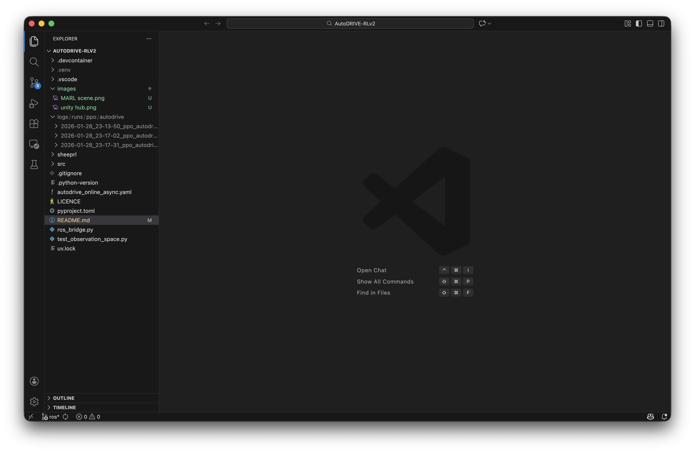
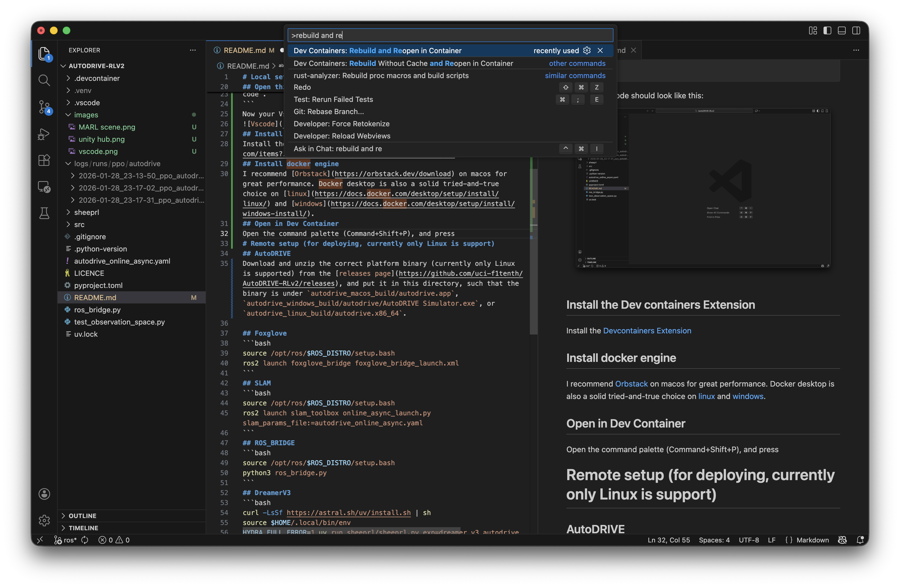
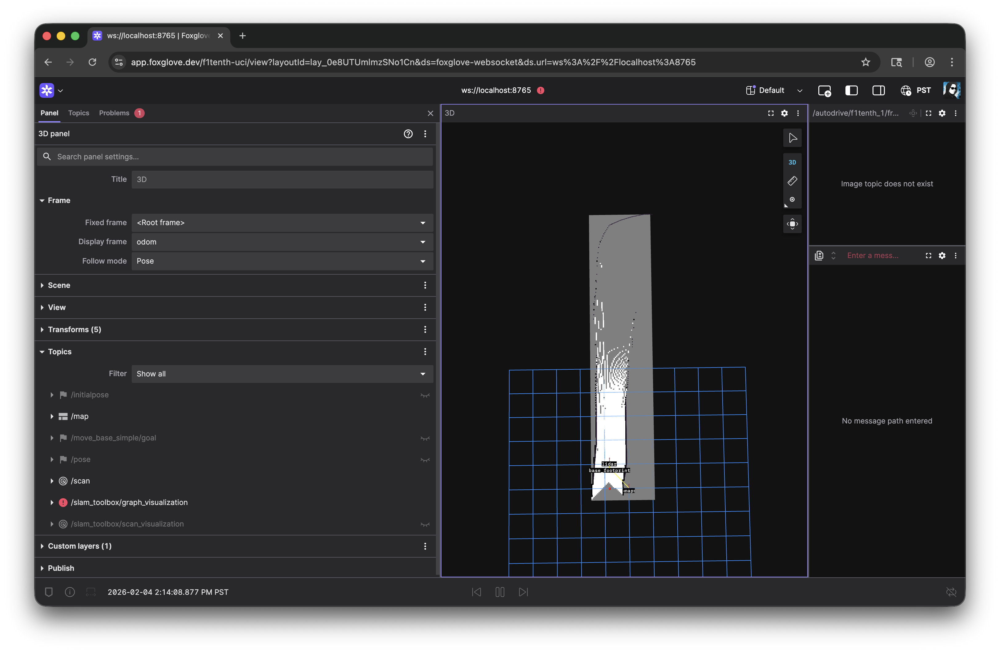
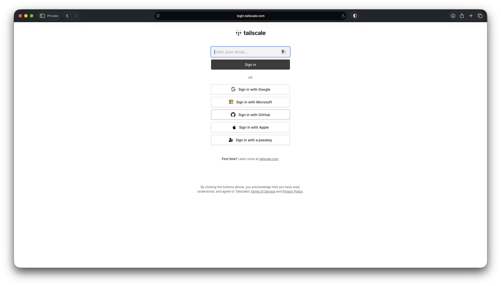
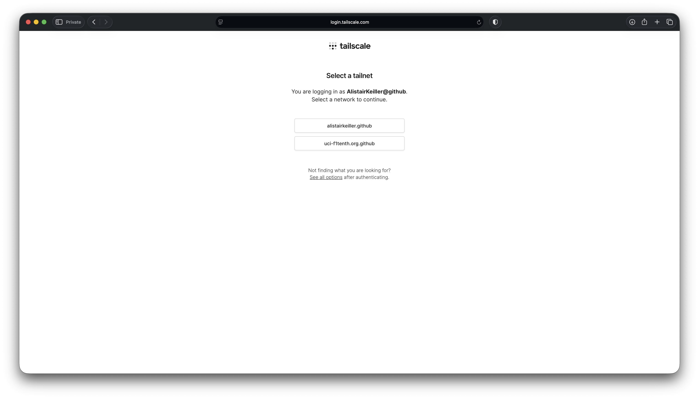
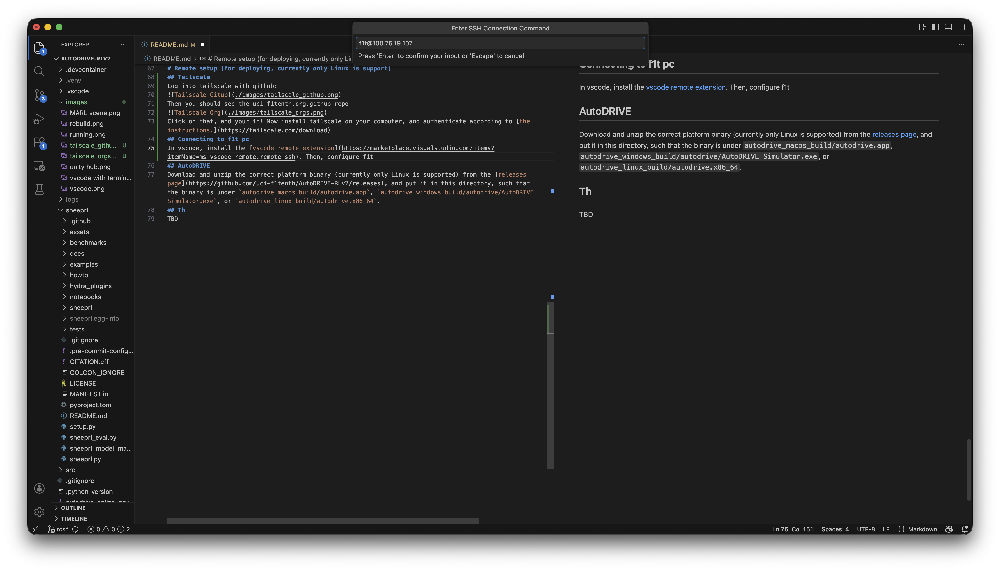

# Local setup (for rapid development)
## Install Unity 2022.3.62f3
Install [unity hub](https://unity.com/download), and install the [unity 2022.3.62f3 editor](https://unity.com/releases/editor/whats-new/2022.3.62f3).
## Clone AutoDRIVE
Clone the AutoDRIVE Simulator:
```bash
git clone --single-branch --branch AutoDRIVE-Simulator https://github.com/uci-f1tenth/AutoDRIVE-v2
```
## Open AutoDRIVE project
[Add the AutoDRIVE from you disk in Unity hub.](https://docs.unity3d.com/hub/manual/AddProject.html). Your Unity Hub should look like this:


Open the AutoDRIVE project in Unity, and open the `F1TENTH - MARL` Scene. Your unity should look like this:

## Clone AutoDRIVE-RLV2
Clone this project with
```
git clone https://github.com/uci-f1tenth/AutoDRIVE-RLv2
```
## Open this project in vscode
```
cd https://github.com/uci-f1tenth/AutoDRIVE-RLv2
code .
```
Now your Vscode should look like this:

## Install the Dev containers Extension
Install the [Devcontainers Extension](https://marketplace.visualstudio.com/items?itemName=ms-vscode-remote.remote-containers)
## Install docker engine
I recommend [Orbstack](https://orbstack.dev/download) on macos for great performance. Docker desktop is also a solid tried-and-true choice on [linux](https://docs.docker.com/desktop/setup/install/linux/) and [windows](https://docs.docker.com/desktop/setup/install/windows-install/).
## Open in Dev Container
Open the command palette (Command+Shift+P), and press "Dev Containers: Rebuild and Reopen in Container":

## Run the following commands in separate terminals in vscode
### PPO (Faster) or DreamerV3 (more accurate)
```bash
curl -LsSf https://astral.sh/uv/install.sh | sh
source $HOME/.local/bin/env
HYDRA_FULL_ERROR=1 uv run sheeprl/sheeprl.py exp=ppo env=autodrive fabric.accelerator=auto
```
or
```bash
curl -LsSf https://astral.sh/uv/install.sh | sh
source $HOME/.local/bin/env
HYDRA_FULL_ERROR=1 uv run sheeprl/sheeprl.py exp=dreamer_v3_autodrive env=autodrive fabric.accelerator=auto
```
### Foxglove
```bash
source /opt/ros/$ROS_DISTRO/setup.bash
ros2 launch foxglove_bridge foxglove_bridge_launch.xml
```
### SLAM
```bash
source /opt/ros/$ROS_DISTRO/setup.bash
ros2 launch slam_toolbox online_async_launch.py slam_params_file:=autodrive_online_async.yaml
```
### ROS_BRIDGE
```bash
source /opt/ros/$ROS_DISTRO/setup.bash
python3 ros_bridge.py
```
## Press play in unity
Hit the play button in the unity editor
## Open Foxglove
Foxglove visualizes our lidar data and ros state. So [make an account](https://foxglove.dev) (the details, like your organization), don't matter. Open ws://localhost:8765. It should look like this:

# Remote setup (for deploying, currently only Linux is support)
## Tailscale
Log into tailscale with github:

Then you should see the uci-f1tenth.org.github repo

Click on that, and your in! Now install tailscale on your computer, and authenticate according to [the instructions.](https://tailscale.com/download)
## Connecting to f1t pc
In vscode, install the [vscode remote extension](https://marketplace.visualstudio.com/items?itemName=ms-vscode-remote.remote-ssh). Then, add f1t as a host (command+shift+p and then type "Add new ssh host"). Then type the ip address of f1t (currently 100.75.19.107, see tailscale for updates).

Then connect to f1t (command+shift+p and then type "Connect to host"), and select f1t under the dropdown. It will prompt you for a password, please ask a f1t board member for the password.
## cd into right directory
```bash
cd ~/Documents/AutoDRIVE-RLv2/
```
## Run the following commands in separate terminals in vscode
### PPO (Faster) or DreamerV3 (more accurate)
```bash
curl -LsSf https://astral.sh/uv/install.sh | sh
source $HOME/.local/bin/env
HYDRA_FULL_ERROR=1 uv run sheeprl/sheeprl.py exp=ppo env=autodrive fabric.accelerator=auto
```
or
```bash
curl -LsSf https://astral.sh/uv/install.sh | sh
source $HOME/.local/bin/env
HYDRA_FULL_ERROR=1 uv run sheeprl/sheeprl.py exp=dreamer_v3_autodrive env=autodrive fabric.accelerator=auto
```
### Foxglove
```bash
source /opt/ros/$ROS_DISTRO/setup.bash
ros2 launch foxglove_bridge foxglove_bridge_launch.xml
```
### SLAM
```bash
source /opt/ros/$ROS_DISTRO/setup.bash
ros2 launch slam_toolbox online_async_launch.py slam_params_file:=autodrive_online_async.yaml
```
### ROS_BRIDGE
```bash
source /opt/ros/$ROS_DISTRO/setup.bash
python3 ros_bridge.py
```
## Open Foxglove
Foxglove visualizes our lidar data and ros state. So [make an account](https://foxglove.dev) (the details, like your organization), don't matter. Open ws://localhost:8765. It should look like this:
